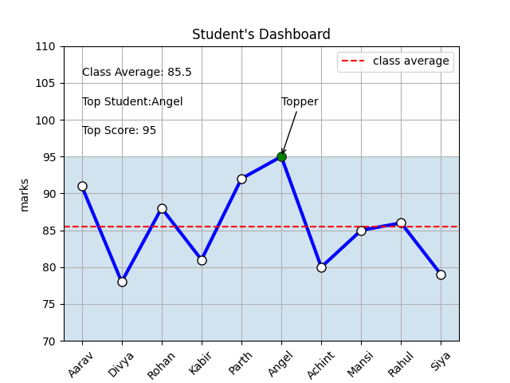

# Student Performance Dashboard

## Overview

This project uses Matplotlib to visualize student performance,
compare individual marks with the class average, and identify
the top-performing student.

## Features

- Visualizes student marks using a line chart
- Calculates and displays the class average
- Highlights the top-performing student
- Displays the top student's score
- Uses shaded regions to show above/below-average performance
- Adds annotations and markers for important data points
- Saves the final visualization as a PNG image

## Matplotlib Concepts Used

- `plt.plot()`
- `plt.figure()`
- `plt.title()`
- `plt.xlabel()` / `plt.ylabel()`
- `plt.grid()`
- `plt.legend()`
- `plt.axhline()`
- `plt.axhspan()`
- `plt.annotate()`
- `plt.text()`
- `plt.xticks()`
- `plt.ylim()`
- `plt.savefig()`

## Key Results

- Class Average: 85.5
- Top Student: Angel
- Top Score: 95

## Dashboard

## What I Learned

Through this project, I practiced creating and styling visualizations
with Matplotlib, working with annotations, reference lines, shaded
regions, text labels, and exporting charts as image files.