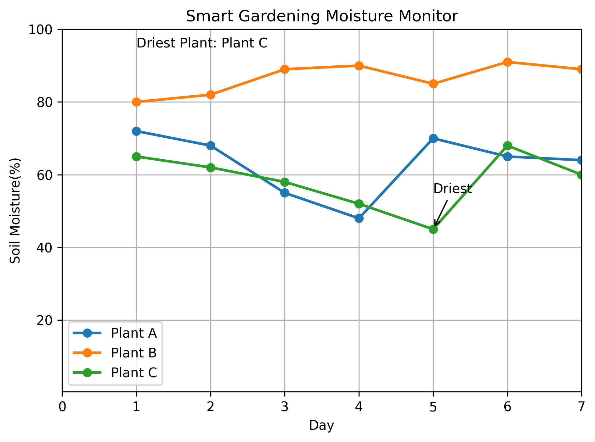

# 🌱 Smart Garden Moisture Monitor

A Matplotlib data visualization project that tracks and compares soil moisture levels across three plants over a 7-day period.

## 📊 Project Overview

The visualization compares the moisture levels of three plants and identifies the plant with the lowest moisture level.

### Key findings

- Plant A lowest moisture: 48%
- Plant B lowest moisture: 80%
- Plant C lowest moisture: 45%
- Driest plant: Plant C
- Driest day for Plant C: Day 5

## 🛠️ Technologies Used

- Python
- Matplotlib
- Jupyter Notebook

## 📈 Visualization

## 🧠 Matplotlib Concepts Practiced

- Multiple line plots
- Markers and line styling
- Legends
- Axis limits
- Grid
- `plt.tight_layout()`
- `plt.annotate()`
- `plt.text()`
- Saving figures with `plt.savefig()`

## 🎯 Purpose

This project was created as part of my Matplotlib learning journey to practice visualizing time-series data and extracting simple insights from it.